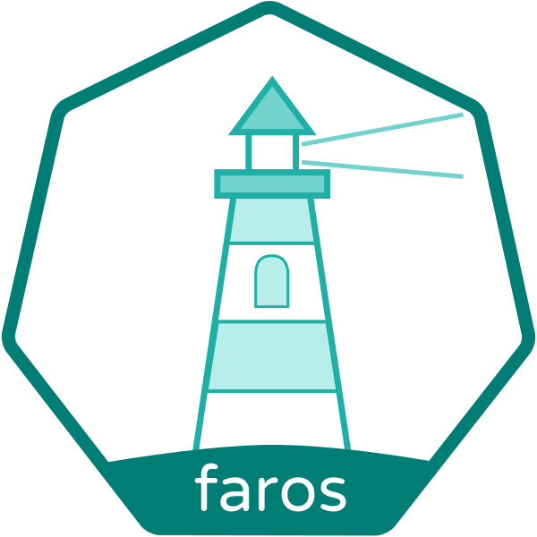

# Faros

> Faros - Greek for Lighthouse

Faros is a GitOps controller that takes a Git repository reference from a
Custom Resource Definition (CRD) and applies resources within the repository to
a Kubernetes cluster.

Note: This is a proof of concept in the early alpha stage.
We are providing no guarantees and recommend that you test and thoroughly
understand the project before deploying to production.

## Table of Contents

- [Introduction](#introduction)
- [Installation](#installation)
  - [Deploying to Kubernetes](#deploying-to-kubernetes)
  - [Configuration](#configuration)
    - [Ignore Resource types](#ignore-resource-types)
    - [Namespace restriction](#namespace-restriction)
    - [Leader Election](#leader-election)
    - [Sync period](#sync-period)
- [Quick Start](#quick-start)
- [Project Concepts](#project-concepts)
  - [Owner References and Garbage Collection](#owner-references-and-garbage-collection)
  - [Three Way Merge](#three-way-merge)
  - [Update Strategies](#update-strategies)
- [Communication](#communication)
- [Contributing](#contributing)
- [License](#license)

## Introduction

Faros aims to make it easier for teams to ensure that the desired state of their
applications is synchronised between a Kubernetes cluster and Git.

Typically, a team running workloads on Kubernetes will use
infrastructure-as-code concepts and keep a copy of their deployment
configuration under source control just as they do with their product code.
The process of taking this desired state from Git and applying it to the
Kubernetes cluster is the problem Faros aims to solve.

By providing Faros with a reference to a Git repository (URL and Git Reference
(eg master)), credentials to access the repository and an optional path within
the repository, Faros will load all Kubernetes resource definitions from the
repository and synchronise these with the Kubernetes cluster.

Faros then watches the child resources (resources created from the repository)
and, if they are ever modified, reverts the change back to the state of the Git
repository.
This allows users to make changes to their deployment configuration exclusively
in Git, which in turn enables them to audit and peer review those changes as
well as providing a canonical history of what was deployed and when.

## Installation

### Building

To build faros locally, run

```
./configure
make build
```

In order to build all binaries for all supported architectures, you may

```
./configure
make release
```

### Deploying to Kubernetes

Faros is a [Kubebuilder](https://github.com/kubernetes-sigs/kubebuilder) based
project, as such we have auto-generated [CRDs](config/crds) and
[Kustomize](https://github.com/kubernetes-sigs/kustomize) configuration as
examples of how to install the controller in the [config](config) folder.
To quickly install the controller and CRDs on a cluster you can run `make deploy`.

You **must** manually install the [CRDs](config/crds) before the controller will
be fully functional, it will not install them for you.

A public docker image is available on [Quay](https://quay.io/repository/pusher/faros).

[](https://quay.io/repository/pusher/faros)

```
quay.io/pusher/faros
```

#### RBAC

If you are using [RBAC](https://kubernetes.io/docs/reference/access-authn-authz/rbac/)
within your cluster, you must grant the service account used by your Faros
instance a superset of all roles you expect it to deploy.

The simplest way to do this is to grant Faros `cluster-admin`, however, if you
wish to be more secure, you can concatenate all `rules` from each Role and
ClusterRole that Faros will manage.

If you do not do so, you will see errors where Faros is attempting to
escalate its privileges.

### Configuration

The following details the various configuration options that Faros provides
at the controller level.

#### Ignore Resource types

You may not want to have Faros manage all types of Kubernetes resource.
The `--ignore-resource` flag allows you to specify a particular Resource to
ignore.

Specify Resources to ignore in the format `<resource>.<api-group>/<api-version>`,
for example to ignore all Kubernetes Jobs specify the following flag:

```
--ignore-resource=jobs.batch/v1
```

It is recommended not to manage `GitTrack` resources using Faros itself,
so ignore those using the following flag:

```
--ignore-resource=gittracks.faros.pusher.com/v1alpha1
```

#### GitTracks and ClusterGitTracks

References to git repositories are known as GitTracks. Faros has 2
different kinds of GitTracks, regular and ClusterGitTrack. Regular
GitTracks exist in a namespace and can only handle resources in that
namespace. ClusterGitTracks live in the cluster scope and can handle
all resources.

This somewhat cumbersome distinction exists because Kubernetes doesn't
allow cross-namespace ownership. For a simple setup, it's recommended
that you use a single ClusterGitTrack to handle your entire cluster.

Faros can be restricted to only handling GitTracks or ClusterGitTracks
with the `--gittrack-mode` and `--clustergittrack-mode` flags

#### Namespace restriction

Faros can be run either as a cluster wide controller or per namespace.

To restrict Faros to watch GitTrack resources only in a single namespace,
use the following flag:

```
--namespace=<namespace>
```

This will restrict Faros to the namespace you provide.
At this point, it will only read GitTrack resources within the defined namespace.
If any GitTrack refers to any resource not in the GitTrack's namespace, the
resource will be ignored.
Therefore a GitTrack in the `default` namespace cannot manage a resource in the
`kube-system` namespace if the controller is restricted to the `default`
namespace.

When restricted to a namespace, Faros **will** still manage any non-namespaced
Kubernetes resource it finds referenced within its GitTracks. If however, the
non-namespaced resource clashes and is defined in another GitTrack within
another namespace, Faros will ignore the resource. First owner wins.

#### Leader Election

Faros can be run in an active-standby HA configuration using Kubernetes leader
election.
When leader election is enabled, each Pod will attempt to become leader and,
whichever is successful, will become the active or master controller.
The master will perform all of the reconciliation of Resources.

The standby Pods will sit and wait until the leader goes away and then one
standby will be promoted to master.

To enable leader election, set the following flags:

```
--leader-election=true
--leader-election-id=<name-of-leader-election-configmap>
--leader-election-namespace=<namespace-controller-runs-in>
```

#### Sync period

The controller uses Kubernetes informers to cache resources and reduce load on
the Kubernetes API server. Every informer has a sync period, after which it will
refresh all resources within its cache. At this point, every item in the cache
is queued for reconciliation by the controller.

Therefore, by setting the following flag;

```
--sync-period=5m // Default value of 5m (5 minutes)
```

You can ensure that every resource will be reconciled at least every 5 minutes.

#### Server Dry Run

By default, the GitTrackObject controller will attempt to dry run updates to
resources before actually applying updates. This helps to prevent unnecessary
updates and allows mutating admission controller results to be observed.

Server side dry run currently sits behind a feature gate within Kubernetes,
please see the table below for compatibility.

| Kubernetes Version | Feature Status                           | Compatible |
| ------------------ | ---------------------------------------- | :--------: |
| **1.14**           | **Beta feature gate enabled (default)**  |  **True**  |
| 1.14               | Beta feature gate disabled               |   False    |
| **1.13**           | **Beta feature gate enabled (default)**  |  **True**  |
| 1.13               | Beta feature gate disabled               |   False    |
| 1.12               | Alpha feature gate enabled               |    True    |
| **1.12**           | **Beta feature gate disabled (default)** | **False**  |
| **1.11**           | **Not Implemented**                      | **False**  |

If your version of Kubernets is incompatible, please disable server dry run as
below:

```
--server-dry-run=false // Defaults to true
```

#### Metrics

The controller exposes a number of metrics in a prometheus format at a
`/metrics` endpoint.
By default, the metrics serving are bound to the address port `8080` on all
interfaces.

Change this with the following flag:

```
--metrics-bind-address=127.0.0.1:8080 // Bind the metrics to localhost only
```

Serving metrics can be disabled by setting the flag to `0`:

```
--metrics-bind-address=0 // Disable serving all metrics
```

##### Available Metrics

- `faros_gittrack_child_status` - Exposes the count of GitTrack child objects
  by status (applied,discovered,ignored,inSync).
- `faros_gittrack_time_to_deploy_seconds_{bucket, count, sum}` - Measures the
  time from updating a repository to the update being propagated to the child
  object.
- `faros_gittrackobject_in_sync` - Indicates whether individual children are in
  sync with their desired state.

- `controller_runtime_reconcile_errors_total` - Counts the total number of
  errors produced by the controller.
- `controller_runtime_reconcile_queue_length` - Counts how many items are
  currently queued for reconciliation by the controller.
- `controller_runtime_reconcile_time_second_{bucket, count, sum}` - Measures how
  long each reconciliation takes within the controller.

## Quick Start

If you haven't yet got Faros running on your cluster, see
[Installation](#installation) for details on how to get it running.

If you would like to deploy a private Git repository, we recommend doing so
using SSH.
To allow Faros access to the repository, place an authorised private key within
a `Secret` in the same namespace that you will create the `GitTrack` in.

Create a `GitTrack` resource based the example below:

```yaml
apiVersion: faros.pusher.com/v1alpha1
kind: GitTrack
metadata:
  name: foo
  namespace: bar
spec:
  # Repository accepts any valid Git repository reference, the most common formats
  # are:
  #   https://<server>/<organisation>/<repository>
  #   <user>@<server>:<organisation>/<repository>
  repository: git@github.com:foo-org/k8s-manifests
  # Reference accepts any valid Git reference, this could be a branch name, tag
  # or commit SHA, eg:
  #   master or refs/remotes/origin/master
  #   v1.0.0 or refs/tags/v1.0.0
  #   ec32c240b7f9b440aa727c9d931751fdd0c40b49
  reference: master
  # (Optional) SubPath expects a path to a folder within the repository.
  # Note: Faros loads all .yml/.yaml/.json files recursively within the path.
  subPath: deployments/kube-system
  # (Optional) DeployKey allows you to specify credentials for repository access
  # over SSH or HTTP Basic Auth
  deployKey:
    # SecretName is the name of the secret containing the secret
    secretName: foo-k8s-manifests
    # Key is the Secret's key containing the secret
    key: id_rsa
    # (Optional) Type is the type of credential. Accepted values are "SSH", "HTTPBasicAuth". Defaults to "SSH"
    # When set to "HTTPBasicAuth" the expected secret format is "<username>:<password>".
    type: SSH | HTTPBasicAuth
```

Deploy the `GitTrack` to your cluster and watch its status as Faros processes
it. Eventually all conditions should have status `True` and the `objectsApplied`
and `objectsInSync` fields should be equal.

```yaml
status:
  conditions:
    - lastTransitionTime: 2018-10-16T17:36:21Z
      lastUpdateTime: 2018-10-16T17:36:21Z
      reason: FileParseSuccess
      status: "True"
      type: FilesParsed
    - lastTransitionTime: 2018-10-16T17:36:21Z
      lastUpdateTime: 2018-10-16T17:36:21Z
      reason: GitFetchSuccess
      status: "True"
      type: FilesFetched
    - lastTransitionTime: 2018-10-16T17:36:21Z
      lastUpdateTime: 2018-10-16T17:36:21Z
      reason: GCSuccess
      status: "True"
      type: ChildrenGarbageCollected
    - lastTransitionTime: 2018-10-16T17:36:21Z
      lastUpdateTime: 2018-10-16T17:36:21Z
      reason: ChildUpdateSuccess
      status: "True"
      type: ChildrenUpToDate
  objectsApplied: 82
  objectsDiscovered: 83
  objectsIgnored: 1
  objectsInSync: 82
```

## Project Concepts

This section outlines some of the underlying concepts that enable this
controller to work in the way it does.

### Owner References and Garbage Collection

Faros uses Kubernetes `OwnerReferences` to leverage built-in
[Garbage Collection](https://kubernetes.io/docs/concepts/workloads/controllers/garbage-collection/).

When Faros manages a resource, it will create a `GitTrackObject`
/`ClusterGitTrackObject` CRD owned by the source `GitTrack` and the `GTO`/`CGTO`
will in turn own the managed resource.

By default, when deleting a `GitTrack`, the Garbage Collector will in turn
delete all dependents (`GTOs`/`CGTOs`) and then delete the dependent's dependents
(managed resources). Therefore, by deleting a `GitTrack`, every resource it was
managing will be deleted.

If you wish to leave objects in place when deleting a `GitTrack`, you can use
the `--cascade=false` flag with `kubectl`.

```
kubectl delete gittrack --cascade=false <gittrack-name>
```

If you wish to remove Faros entirely, we recommend deleting all `GitTrack` and
then `GitTrackObject` and `ClusterGitTrackObject` resources using the
`--cascade=false` flag.

### Three Way Merge

Faros uses a three-way merging strategy to determine the patch to apply when
updating resources. In a similar way to `kubectl apply`, Faros applies a
`last-applied` annotation to resources that it manages.

It uses this annotation, along with the current specification of the Resource
and the existing Resource retrieved from the Kubernetes API to calculate the
desired change to any Resource.

This strategy means that Faros will not interfere with any changes made by
other controllers running on the cluster or changes made outside of Git that
do not conflict with the desired state of the Resource in Git.

For example, when using a Horizontal Pod Autoscaler (HPA) with a Deployment,
if the Deployment explicitly sets the number of desired replicas
(`.spec.replicas`), each time the HPA scales the Deployment, Faros would undo
this action replacing it with the value in the Deployment's spec from Git.
However, if the field is unspecified in the Deployment's spec in Git, Faros
would ignore the update since it does not cause a clash with the defined
desired state.

### Update Strategies

Some Kubernetes resources have fields that are immutable, for example the
spec of a Job is immutable once created. If you were ever to update the spec
of a Resource like this, Faros would encounter an error when attempting to apply
the updated Resource.

To change the update behaviour of individual Resources managed by Faros you can
set an annotation on the individual Resource within your Git repository and have
Faros read this before it attempts to apply the Resource.

Add the annotation `faros.pusher.com/update-strategy` to your resource with one
of the following values:

- `update`: This is the default value. Faros will update the Resource in place.
  This is equivalent to a `kubectl apply`.
- `never`: Faros will ensure that the Resource exists within Kubernetes but will
  never update it if the Resource is modified.
- `recreate`: Faros will first attempt to patch the resource, if this fails it
  will delete the existing Resource and create a new copy.
  This is equivalent to a `kubectl apply --force`.

For example:

```
apiVersion: batch/v1
kind: Job
metadata:
  annotations:
    faros.pusher.com/update-strategy: never
...
```

This annotation is designed to be used in special cases where individual
Resources need special handling by Faros. If you wish to ignore a particular
type of Resource altogether (eg. ignoring all Jobs), see
[Ignore Resource types](#ignore-resource-types).

## Communication

- Found a bug? Please open an issue.
- Have a feature request. Please open an issue.
- If you want to contribute, please submit a pull request

## Contributing

Please see our [Contributing](CONTRIBUTING.md) guidelines.

## License

This project is licensed under Apache 2.0 and a copy of the license is available [here](LICENSE).
